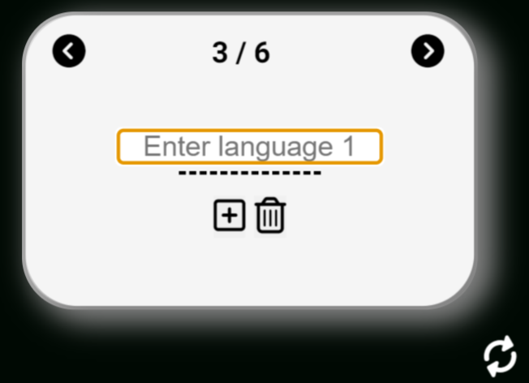

# LOVE-TO-EARN
This is the website for a vocabulary learning: LOVE-To-LEARN (L2L): [LOVE-TO-LEARN](https://troeske.github.io/love-to-learn/). 

I was inspired to implement this site after helping one of my daughters to learn english vocabulary focussed on certain topics (in her case crime & punishment and UK disparities) for her highschool exam a 3 weeks ago. Though she has successfully passed her exam already before I started the web app, it served as my inspiration and decisions on MVP functionality. With this past but real use case in mind I probably got carried away with MVP functionality and it turned into an NVP: Nice Viable Product. 

## User Experience

### Target Audience:
    anybody who is looking for a simple vocabulary learning app that allows manual entering and saving of vocabulary cards as well as opening existing exercise books. 

### User Stories:
    (1) as a user I want to load my existing vocabulary exercise book (as .csv file) into L2L. 
    (2) as a user I want to be able to type in the answer for a word and get feedback if I spelled the word correctly.
    (3) as a user I want to have to the option not to type in the word but have it displayed when pressing a button after picturing the correctr answer in ones mind.
    (4) as a user I want to see how many words I got right and how many I did not.
    (5) as a user I want to see where I am in the exercise book and how many words are left.
    (6) as a user I want to be able to add my own word pairs to my current exercise book.
    (7) as a user I want to be ablt to save my additions and the current exercise book. 
    (8) as a user I want create my own exercise book and save it.
    
### Future Use-Cases
    (9) help with pronoucing the words correctly
    (10) saving learning progress beyond the current session
    (11) voice to text entering
    (12) more complex learning cards for flexibel content (pictures, lists etc.) to facilitate learning any kind of content 

## Design
### Site Structure
The site implements a simple structure with one landing page 

### Wireframes
__Mobile First approach:__

__Tablet and Desktop:__

Web site react responsive by slightly adjusting the layout where necessary.

### Imagery used
Simple iconography for intuitive and clean UI.

### Colour Scheme
Black and white with highlight colors - neon green and red - signifiying right and wrong answers.
        
### Typography
All text is based on the sans-serif free Google font: Roboto.

## Current Features:

### Landing Page
The landing page is the core of the Love-To-Learn Site. It shows everything the user needs to get started with the learning experience.
 

- __Usernname__
To make the experience personal L2L asks the users for their Name or Alias. 
 
 

If the user decides not to fill in any data, L2L selects a default:
 

- __Exercise Book Details__
This area shows the Name of the Exercise Book, the current topic within the Exercise Book and the languages to be learned.
 

### Word Card
- __Results Area__
The results of the current learning session is presented below the Word Card:
 

### Navigation Bar
The Navigation Bar provides buttons to manage Exercise Books and acces to the Help/Info function.
 

- __Info Button__
The Info Button displays infos on each of the buttons of the L2L Site.  One click on the Info Button will show the Info/Help text for each of the main site elements. When pressed again the info will disapear again. 

 

- __Save Exercise Book__
 

 
At any time the user can save the current Exercise Book. The browser treats this as a file download and on mobile it is typically saved to the DOWNLOADS directory by default.
(on mobiles it typically is saved to the DOWNLOADS directory by default)
 

- __Download Template__
 

 

To make it easy to build your own Exercise Book, L2L provides a template download function. Save the file at a destination of your choice (on mobiles it typically is saved to the DOWNLOADS directory by default). The user can open the file in a text editor or spreadsheet program to manually enter word pairs.
The Load Exercise Book function allows the loading of the downloaded template into L2L and the user can use the L2L __Add Card__ function to add words as desired.

- __Load Exercise Book__
 

Users can load their existing (or previsously saved) Exercise Books intto L2L to start learning right away.

### Learning Mode
Core of L2L is to help user learn vocabulary. After loading an existing Exercise Book or maually entering a desired vocabulary the users can get start to learn and test their knowledge and progress.

- __Navigating the Exercise Book__
 

 

The top of the front of the Word Card has buttons to step forward (Next Button) or backward (Previous Button) in the current Exercise Book and shows the current position in the Exercise Book. The Front also shows the original word to be learned.

- __Learning and Testing your Knowledge__
To learn the card, the user clicks on the flip card button and can press on the magnifying glass to display the translation of the original word.
 

 

- __Verifying your Result - correct__
Once the user has mastered the word, they can either type in the translation in to the input field and press ENTER (or the Enter button). If the translation was correct, the card will turn green and the 'got it' counter increases. 

- __Verifying your Result - incorrect__
If the translation was wrong the card turns red and the 'to improve' counter increases.

The user can also keep the translation in mind and just click on the magnisfying glass to see if they were right. If they were correct, they can press the correct button below the input field. The card will turn green and the 'got it' counter increases. If they were wrong they can press the x-button  below the input field and the card turns red and the 'to improve' counter increases.

The user can also flip back to the front and look at the orignal word again.

### Add a Word Card
 

 

The user can manually add words to the current Exercise Book or start a new Exercise Book from scratch. To add words, the users clicks on the + Button on the front of the word card. When hitting Enter or clicking on flip-card, the card will turn to the backside and the user can enter the translation. L2L will save the card once the user hits Enter, clicks the Enter-Button or the Correct-Button below the input field for the translated word. Automatically the card will flip to the front to get back into learning mode.

### Delete current Word Card
The user can delete a card in the current Exercise Book by clicking on the trash button below the original word on the fron of the card. A confirm/Cancel message will pop up and the card will be deleted.
 

 

## Manual Testing

__Various Browsers on mobile and desktop devices:__

| Feature | Action | Expected Behaviour | android-chrome | android-firefox | android-edge | desktop-chrome | desktop-firefox | desktop-safari | desktop-edge | iOS safari | iOS android |
| ------- | ------ | ----------------- | ------ | ------- | ------ | ----------------- | ------ | ------- | ------ | ----------------- | ------ |
| Home Navbar | click on Logo | load landing page | ok | ok | ok | ok | ok | ok | ok | ok | ok |
| Drop Down Menu | click on hamburger menu | Hamburger menu opens | ok | ok | ok | ok | ok | ok | ok | ok | ok |
| Rendering of products page | load products page | page shows as deseigned | ok |ok | ok | ok | ok | ok | ok | ok | ok |
| Rendering of lunch page | load lunch page | page shows as deseigned | ok |ok | ok | ok | ok | ok | ok | ok | ok |
| Rendering of about page | load about page | page shows as deseigned | ok |ok | ok | ok | ok | ok | ok | ok | ok |

### Open Issues
__Merge manual Cards when loading new Exercise Book:__
When a user has manually entered cards and then loads an exercise book the manual cards will be lost.

## Code Validation
### W3 HTML Validator https://validator.w3.org/nu/#textarea
__Results:__
All html pages were checked by the w3 html validator and no errors remain.
 

 

### CSS Validator https://jigsaw.w3.org/css-validator/validator
__Results:__
All css files were checked by the w3c css validator and no errors remainn. Remaining warnings are due to the use of css variables.
 

 

## Deployment
This section should describe the process you went through to deploy the project to a hosting platform (e.g. GitHub) 

The site was deployed to GitHub pages. The steps to deploy are as follows: 
  - In the GitHub repository, navigate to the Settings tab 
  - From the source section drop-down menu, select the Master Branch
  - Once the master branch has been selected, the page will be automatically refreshed with a detailed ribbon display to indicate the successful deployment. 

The live link can be found here: https://troeske.github.io/love-to-learn/  

## Credits
### Tutorials
no tutorials were used

### Code
W3Schools: https://www.w3schools.com/
MDN Web Docs: https://developer.mozilla.org/en-US/
GeeksForGeeks: https://www.geeksforgeeks.org/

The core of following functions was provided by Github Copilot:

    (1)  the upload/import of an exisiting .CSV file (incl. handleFileSelect(), csvToArray() )
    (2)  the 3D flip card design and animation (incl. respective code in DOMContentLoaded EventListner)
    (3)  drawDividerBack(), drawDividerFront()
    (4)  the convert array to CSV conversion: convertArrayToCSV()
    (5)  basic struncture of editH2Content() (especially the ***.childNodes[0].nodeValue solution)
    (6)  the basic structure idea of a modal dialog of the greetUser() function 

### Graphics
icons: https://fontawesome.com/
favicon: https://www.freepik.com/icon

### Photos

### Any other resources
https://validator.w3.org/nu/#textarea
https://jigsaw.w3.org/css-validator/validator

